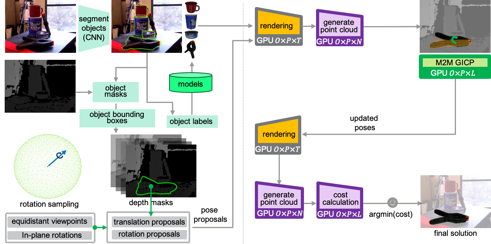

# PERCH 2.0 : Fast and High Quality GPU-based Perception via Search for Object Pose Estimation



Overview
--------
This library provides implementations for single and multi-object pose estimation from RGB-D sensor (MS Kinect, ASUS Xtion, Intel RealSense etc.) data and CAD models. It can evaluate thousands of poses in parallel on a GPU in order to find the pose that best explains the observed scene using CUDA. Each pose is refined in parallel through CUDA based GICP. PERCH 2.0 works in conjunction with an instance segmentation CNN for 6-Dof pose estimation (Tested with YCB Video Dataset).

Features
------------
* Detect 3Dof poses (in a tabletop setting) in under 1s
* No pretraining required
* Works with depth data from typical RGBD cameras
* Get high detection accuracies required for tasks such as robotic manipulation 
* Get 6-Dof poses directly from output of 2D segmentation CNN

System Requirements
------------
- Ubuntu (>= 16.04) 
- NVidia GPU (>= 4GB)

Docker Setup
------------
Follow the steps outlined in this [Wiki](https://github.com/SBPL-Cruz/perception/wiki/Running-With-Docker#using-docker-image) to setup the code on your machine. The code will be built and run from the Docker image.

Running with YCB Video Dataset
-----------------------
Follow the steps outlined in this [Wiki](https://github.com/SBPL-Cruz/perception/wiki/Running-With-Docker#running-6-dof--ycb_video_dataset) to run the code on YCB Video Dataset. It can run using PoseCNN masks, ground truth masks or a custom MaskRCNN model trained by us. The model is trained to detect full bounding boxes and instance segmentation masks of YCB objects in the dataset.

Results : 


Running with Robot
------------------
PERCH 2.0 communicates with the robot's camera using ROS. Follow the steps outlined in this [Wiki](https://github.com/SBPL-Cruz/perception/wiki/Running-on-Robot) to first test the code with bagfiles. You can then use the bagfile setup of your choice and modify it as per the robot requirements.

Citation
----
Please use the citation below if you use our code :
```
@mastersthesis{Agarwal-2020-122934,
author = {Aditya Agarwal},
title = {Fast and High-Quality GPU-based Deliberative Perception for Object Pose Estimation},
year = {2020},
month = {June},
school = {},
address = {Pittsburgh, PA},
number = {CMU-RI-TR-20-22},
keywords = {pose estimation, deliberative perception, manipulation},
}
```
